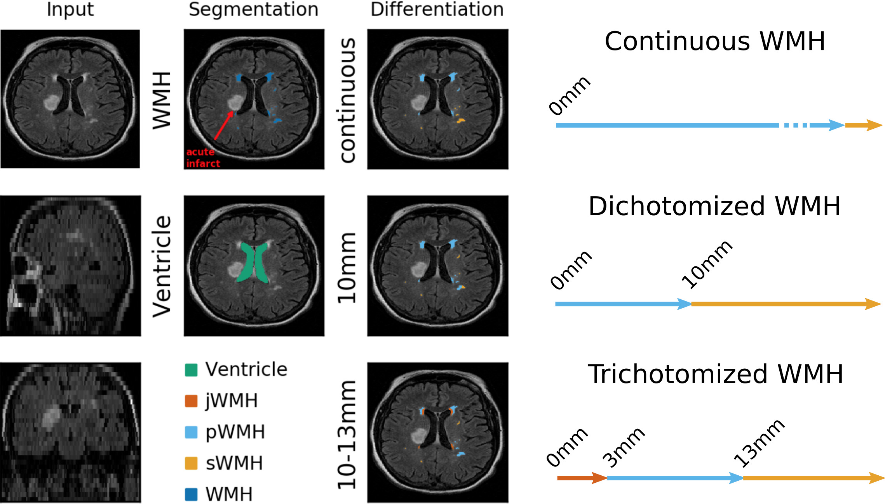

# WMH Classifier

A tool for spatial stratification of white matter hyperintensities (WMH) based on their proximity to the lateral ventricles.

## Background

White matter hyperintensities are commonly categorized by their spatial relationship to the ventricles, as different locations may have distinct clinical significance and pathophysiological mechanisms. This tool implements three established classification approaches from the literature:

### Classification Methods

**1. Continuous (Overlap-Based)**
- Periventricular WMH (pWMH): Any lesion adjacent and continuous to the ventricular surface
- Subcortical WMH (sWMH): All remaining WMH
- Method: Individual WMH regions are labeled, each dilated by 1 voxel (6-connected), and regions whose dilations overlap are merged into single units. Merged regions are then classified based on overlap with dilated ventricle mask.

**2. 10mm Distance Threshold**
- Periventricular WMH (pWMH): WMH within 10mm of ventricular surface
- Subcortical WMH (sWMH): WMH beyond 10mm from ventricular surface
- Method: Euclidean distance transform from ventricle surface

**3. Juxta (Juxtaventricular-Periventricular-Deep)**
- Juxtaventricular WMH (jWMH): WMH within 3mm of ventricular surface
- Periventricular WMH (pWMH): WMH between 3-13mm from ventricular surface
- Deep/Subcortical WMH (sWMH): WMH beyond 13mm from ventricular surface
- Method: Euclidean distance transform with two thresholds


*Figure: Examples of all three WMH classification approaches applied to the same scan. The continuous method uses overlap-based merging with morphological operations, while the 10mm and juxta methods use Euclidean distance transforms.*

### Technical Implementation

**Preprocessing:**
- Images are resampled to ensure all dimensions are ≤1mm resolution (upsampling only where needed)
- Ventricle masks are dilated to compensate for potential partial volume effects in ventricular segmentation

**Continuous Method:**
1. Label all individual 3D-separable WMH regions using connected component analysis
2. Dilate each region independently by 1 voxel (6-connected, face neighbors only)
3. Check pairwise overlap between dilated regions - overlapping regions are merged
4. Dilate ventricle mask to define periventricular zone
5. Classify each merged region: overlapping with dilated ventricles → pWMH, otherwise → sWMH
6. Apply classifications to original (undilated) WMH voxels

**Distance-Based Methods:**
1. Compute Euclidean distance transform from ventricle surface
2. Account for anisotropic voxel spacing
3. Classify each WMH voxel based on distance thresholds
4. Generate zones according to specified thresholds

## Installation

### Requirements
- Python 3.7+
- nibabel (NIfTI file handling)
- numpy (numerical operations)
- scipy (distance transforms, morphological operations)
- scikit-image (connected component labeling)

### Install
```bash
git clone https://github.com/mdschirmer/wmh-classifier.git
cd wmh-classifier
pip install -r requirements.txt
chmod +x wmh_classifier.py
```

## Usage

### Quick Examples
```bash
# Continuous method (default)
python wmh_classifier.py -i wmh.nii.gz -v ventricles.nii.gz -o stats.csv

# 10mm distance threshold
python wmh_classifier.py -i wmh.nii.gz -v ventricles.nii.gz -o stats.csv \
    --distance-thresholds 10

# Juxta method (3mm, 13mm thresholds)
python wmh_classifier.py -i wmh.nii.gz -v ventricles.nii.gz -o stats.csv \
    --distance-thresholds 3,13 --zone-names juxta,peri,deep

# Save classified masks
python wmh_classifier.py -i wmh.nii.gz -v ventricles.nii.gz -o stats.csv \
    --distance-thresholds 3,13 --zone-names juxta,peri,deep --save-masks

# Disable automatic resampling (if images already ≤1mm isotropic)
python wmh_classifier.py -i wmh.nii.gz -v ventricles.nii.gz -o stats.csv \
    --no-resample
```

### Command-Line Arguments

**Input (mutually exclusive):**
- `-i, --input PATH` - Single WMH mask (requires `-v`)
- `--input-csv PATH` - CSV file with multiple wmh_mask,ventricle_mask pairs

**Required:**
- `-v, --ventricle PATH` - Ventricle mask (required with `-i`)
- `-o, --output PATH` - Output CSV file path

**Classification Method:**
- `--distance-thresholds T1,T2,...` - Distance thresholds in mm (comma-separated)
  - If not provided, uses continuous (overlap-based) method
  - Examples: `10` for binary, `3,13` for juxta method
- `--zone-names NAME1,NAME2,...` - Custom zone names (must match number of zones)

**Method Parameters:**
- `--vent-dilation N` - Ventricle dilation iterations (continuous method only, default: 1)
- `--no-resample` - Disable automatic resampling to ≤1mm resolution (default: enabled)

**Output Options:**
- `--save-masks` - Save classified NIfTI masks
- `--verbose` - Enable detailed progress output
- `-h, --help` - Show help message

### Batch Processing

Create an input CSV file:
```bash
cat > pairs.csv << PAIRS
wmh_mask,ventricle_mask
/data/sub-001/sub-001_WMH.nii.gz,/data/sub-001/sub-001_ventricles.nii.gz
/data/sub-002/sub-002_WMH.nii.gz,/data/sub-002/sub-002_ventricles.nii.gz
/data/sub-003/sub-003_WMH.nii.gz,/data/sub-003/sub-003_ventricles.nii.gz
PAIRS

# Process all subjects
python wmh_classifier.py --input-csv pairs.csv -o batch_results.csv \
    --distance-thresholds 3,13 --zone-names juxta,peri,deep --save-masks
```

## Output Format

### CSV Output

All results are saved to a CSV file with the following structure:

**Core Columns:**
- `wmh_file` - Path to input WMH mask
- `ventricle_file` - Path to input ventricle mask
- `method` - Classification method identifier
  - `"continuous"` for overlap-based
  - `"0-10"` for 10mm threshold
  - `"0-3-13"` for juxta method
  - Custom format for other thresholds
- `zone_mapping` - Translation key showing zone numbers and names
  - Example: `"1:juxta;2:peri;3:deep"`
- `total_voxels` - Total WMH voxel count
- `total_volume_cc` - Total WMH volume in cubic centimeters (cc)

**Zone-Specific Columns (dynamic based on method):**
- `zone1_voxels`, `zone1_volume_cc`, `zone1_percent` - Zone 1 statistics
- `zone2_voxels`, `zone2_volume_cc`, `zone2_percent` - Zone 2 statistics
- `zone3_voxels`, `zone3_volume_cc`, `zone3_percent` - Zone 3 statistics (if applicable)
- Additional zones as needed

**Optional Column:**
- `classified_mask` - Path to classified NIfTI mask (if `--save-masks` used)

**Note:** All zones are always included in output, even if they contain zero voxels.

### Example CSV Output
```csv
wmh_file,ventricle_file,method,zone_mapping,total_voxels,total_volume_cc,zone1_voxels,zone1_volume_cc,zone1_percent,zone2_voxels,zone2_volume_cc,zone2_percent,classified_mask
/data/sub-001_WMH.nii.gz,/data/sub-001_vent.nii.gz,continuous,"1:periventricular;2:subcortical",15234,12.4567,11234,9.1872,73.74,4000,3.2695,26.26,sub-001_WMH_wmhc-cont_01.nii.gz
/data/sub-001_WMH.nii.gz,/data/sub-001_vent.nii.gz,0-10,"1:0-10mm;2:>10mm",15234,12.4567,9500,7.7634,62.35,5734,4.6933,37.65,,sub-001_WMH_wmhc-0-10_01.nii.gz
/data/sub-001_WMH.nii.gz,/data/sub-001_vent.nii.gz,0-3-13,"1:juxta;2:peri;3:deep",15234,12.4567,3200,2.6145,21.01,8000,6.5389,52.51,4034,3.3033,26.48,sub-001_WMH_wmhc-0-3-13_01.nii.gz
```

### NIfTI Mask Output

When `--save-masks` is specified, classified masks are saved as:

**File Location:** Same directory as output CSV

**Naming Convention:**
- Continuous: `{basename}_wmhc-cont_01.nii.gz`
- Distance-based: `{basename}_wmhc-{thresholds}_01.nii.gz`
  - Examples: 
    - `sub-001_WMH_wmhc-0-10_01.nii.gz`
    - `sub-001_WMH_wmhc-0-3-13_01.nii.gz`

**Voxel Values:**
- `0` - Background (no WMH)
- `1` - Zone 1 (periventricular, 0-3mm, or 0-10mm depending on method)
- `2` - Zone 2 (subcortical, 3-13mm, or >10mm depending on method)
- `3` - Zone 3 (deep, >13mm - only for juxta method)
- Additional values for custom multi-zone classifications

**The `_01` suffix** indicates classification system version/variant, allowing future extensions.

## Detailed Examples

### Example 1: Continuous Classification
```bash
python wmh_classifier.py \
    -i data/sub-001/sub-001_WMH.nii.gz \
    -v data/sub-001/sub-001_ventricles.nii.gz \
    -o results/sub-001_continuous.csv \
    --vent-dilation 1 \
    --save-masks \
    --verbose

# Output:
#   results/sub-001_continuous.csv
#   results/sub-001_WMH_wmhc-cont_01.nii.gz
```

### Example 2: 10mm Distance Threshold
```bash
python wmh_classifier.py \
    -i data/sub-001/sub-001_WMH.nii.gz \
    -v data/sub-001/sub-001_ventricles.nii.gz \
    -o results/sub-001_10mm.csv \
    --distance-thresholds 10 \
    --save-masks
```

### Example 3: Juxta Method (Clinical Standard)
```bash
python wmh_classifier.py \
    -i data/sub-001/sub-001_WMH.nii.gz \
    -v data/sub-001/sub-001_ventricles.nii.gz \
    -o results/sub-001_juxta.csv \
    --distance-thresholds 3,13 \
    --zone-names juxta,peri,deep \
    --save-masks
```

### Example 4: Batch Processing
```bash
# Generate pairs.csv from directory structure
echo "wmh_mask,ventricle_mask" > pairs.csv
for subject_dir in data/sub-*; do
    subject=$(basename "$subject_dir")
    wmh="${subject_dir}/${subject}_WMH.nii.gz"
    vent="${subject_dir}/${subject}_ventricles.nii.gz"
    [ -f "$wmh" ] && [ -f "$vent" ] && echo "${wmh},${vent}" >> pairs.csv
done

# Process all subjects with juxta method
python wmh_classifier.py \
    --input-csv pairs.csv \
    -o batch_results_juxta.csv \
    --distance-thresholds 3,13 \
    --zone-names juxta,peri,deep \
    --save-masks
```

## Method Comparison

| Method | Zones | Definition | Use Case |
|--------|-------|------------|----------|
| **Continuous** | 2 | Adjacent/connected vs non-adjacent to ventricles | Traditional binary classification, robust to fragmented segmentations |
| **10mm** | 2 | ≤10mm vs >10mm from ventricle surface | Simple distance cutoff, clinically interpretable |
| **Juxta** | 3 | 0-3mm, 3-13mm, >13mm | Distinguishes immediately adjacent (juxta) from other periventricular WMH |
| **Custom** | 2+ | User-defined thresholds | Research-specific definitions, fine-grained spatial analysis |

### When to Use Each Method

**Continuous:**
- Comparing with studies using traditional Fazekas or other visual rating scales
- When lesion connectivity matters more than exact distance
- Robust to salt-and-pepper segmentation artifacts
- Faster computation (no distance transform needed)
- Preserves individual lesion identity while merging nearby fragments

**10mm Distance:**
- Simple, interpretable cutoff
- Consistent with many clinical definitions
- Good for initial exploratory analyses
- Voxel-level classification (independent of lesion connectivity)

**Juxta (3mm, 13mm):**
- Most detailed standard classification
- Aligns with literature distinguishing juxtaventricular from periventricular
- Recommended for comprehensive spatial analysis
- Best for relating to pathophysiology (different vascular territories)

**Custom:**
- Exploratory analyses with multiple distance bands
- Validating optimal distance thresholds for your cohort
- Research questions requiring specific distance ranges

## Algorithm Details

### Continuous Method
```
1. Load and binarize inputs
2. Resample to ≤1mm resolution (upsamples coarse dimensions only)
3. Label all 3D-separable WMH regions (connected component analysis)
4. For each region independently:
   - Dilate by 1 voxel (6-connected, face neighbors only)
   - Store dilated version
5. Check pairwise: if dilated region A ∩ dilated region B ≠ ∅:
   → Mark A and B for merging
6. Use union-find to merge all transitively connected regions
7. Dilate ventricle mask by N iterations (default 1)
   → Compensates for partial volume effects
8. For each merged region:
   IF overlaps with dilated ventricles:
      Label as periventricular (1)
   ELSE:
      Label as subcortical (2)
9. Resample back to original resolution
10. Calculate statistics in original space
```

**Key Features:**
- Merges salt-and-pepper fragments (`1 0 1 0 1`) into single regions
- Keeps distant lesions (`1 0 0 1`) separate
- Classification applied to original (undilated) WMH voxels
- Union-find handles transitive merging automatically

**Parameters:**
- `--vent-dilation`: Controls periventricular zone size (increase for broader definition)
- `--no-resample`: Disable automatic upsampling (use if already high resolution)

### Distance-Based Methods
```
1. Load and binarize inputs
2. Resample to ≤1mm resolution (upsamples coarse dimensions only)
3. Invert ventricle mask (1 = outside, 0 = inside)
4. Compute Euclidean distance transform:
   distance(x,y,z) = √[(Δx·sx)² + (Δy·sy)² + (Δz·sz)²]
   → Accounts for anisotropic voxels
5. For each WMH voxel:
   Classify into zone based on distance and thresholds:
   - Thresholds [T1, T2, ...] create zones:
     [0, T1), [T1, T2), [T2, T3), ..., [Tn, ∞)
6. Assign zone labels (1, 2, 3, ...) to output mask
7. Resample back to original resolution
8. Calculate statistics in original space
```

**Advantages:**
- Exact distances (not affected by connectivity)
- Consistent across different voxel resolutions
- Can create any number of zones
- Accounts for anisotropic voxels automatically
- Voxel-level classification (each voxel independent)

## Python API

For programmatic use in scripts or pipelines:
```python
from wmh_classifier import WMHClassifier

# Continuous method
classifier = WMHClassifier(
    vent_dilations=2,
    verbose=True
)

# Distance-based method (Juxta)
classifier = WMHClassifier(
    distance_thresholds=[3, 13],
    zone_names=['juxta', 'peri', 'deep'],
    verbose=True
)

# Process single subject
result = classifier.process_single(
    wmh_path='data/sub-001_WMH.nii.gz',
    ventricle_path='data/sub-001_ventricles.nii.gz'
)

# Access results
print(f"Method: {result['method']}")
print(f"Zone mapping: {result['zone_mapping']}")
print(f"Total WMH volume: {result['total_volume_cc']:.2f} cc")
print(f"Zone 1: {result['zone1_voxels']} voxels ({result['zone1_percent']:.1f}%)")
```

## Performance Considerations

**Continuous method:**
- Moderate speed (region merging overhead)
- Memory efficient
- Scales with number of initial WMH regions
- Typical: 10-20 seconds per subject

**Distance-based methods:**
- Slower (distance transform computation)
- More memory intensive for large volumes
- Computation time independent of WMH load
- Typical: 15-30 seconds per subject

**Batch processing:** Add ~1-2 seconds overhead per subject

**Resampling:** Adds 2-5 seconds per subject for anisotropic data

## Citation

If you use this tool in your research, please cite:
```bibtex
@software{wmh_classifier_2025,
  author = {Markus D. Schirmer},
  title = {WMH Classifier: Spatial Stratification of White Matter Hyperintensities},
  year = {2025},
  url = {https://github.com/mdschirmer/wmh-classifier},
  version = {1.0.0}
}
```

**Formatted citation:**

Markus D. Schirmer. (2025). *WMH Classifier: Spatial Stratification of White Matter Hyperintensities* (Version 1.0.0) [Computer software]. GitHub. https://github.com/mdschirmer/wmh-classifier

## License

MIT License - See LICENSE file for details

## Contributing

Contributions are welcome! Areas for improvement:
- General testing and validation
- Additional classification methods
- Performance optimizations
- GUI interface
- Docker container
- Unit tests

Please submit pull requests or open issues on GitHub.

## Support

- **Issues:** Open an issue on GitHub
- **Questions:** Use GitHub Discussions
- **Documentation:** See QUICKSTART.md for quick reference

## Acknowledgments

This tool implements classification methods described in the neuroimaging literature for spatial stratification of white matter hyperintensities. The three standard methods (continuous, 10mm, juxta) are based on established approaches in the field.